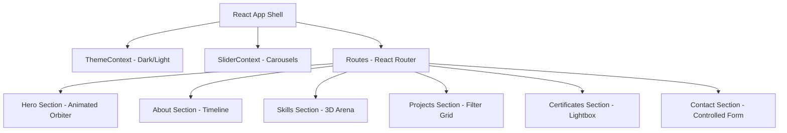

<div align="center">


# ⚡ Plain JavaScript React Developer Portfolio
### 🚀 Built with React 19, JSX, GSAP Parallax, and Custom CSS (Syllabus-Aligned)

**`BCA Student | React Developer | UI/UX Enthusiast | Code. Create. Innovate.`**

<br/>

[](https://reactjs.org/)
[](https://developer.mozilla.org/en-US/docs/Web/JavaScript)
[](https://vitejs.dev/)
[](https://www.framer.com/motion/)
[](https://gsap.com/)
[](https://vercel.com)
[](LICENSE)

<br/>

**[🌐 Live Demo](https://void-by-sindhav.vercel.app/) &nbsp;•&nbsp; [📦 GitHub Code](https://github.com/sindhavdinesh/react-portfolio-)**

</div>

---

> [!IMPORTANT]
> **100% SYLLABUS COMPLIANT (NO TYPESCRIPT)**
> This portfolio is built strictly using **standard JavaScript, JSX, and raw CSS** according to college curriculum guidelines. It contains **zero** TS interfaces, type aliases, React.FC wrappers, or `.d.ts` configurations. It runs purely on standard browser-friendly ES6+ React state and lifecycle hooks.

---

## 🌟 Key Highlights & Design Aesthetics

- **Curated Harmonious Theme**: Premium glowing dark mode (default) with a beautifully integrated custom light mode using HSL-tailored colors.
- **Glassmorphic Elements**: Modern translucent cards using background blur filters (`backdrop-filter: blur(10px)`) and subtle border glows.
- **Interactive Micro-Animations**: Buttons, skill cards, and page elements react dynamically on hover and scroll.
- **Responsive Layout**: Designed perfectly to look stunning on Mobile Portrait, Mobile Landscape, Tablets, Laptops, and Desktops.

---

## ✨ Dhansu Features Breakdown



### 1. 🌀 Interactive 3D Skill Arena Cloud
- **Mouse Coordinate Parallax**: GSAP tracks mouse movement inside the arena box and shifts the floating icons dynamically using depth coefficients (`0.3` / `0.55` / `0.8`).
- **Interactive Tooltips**: Hovering over any floating icon reveals a custom tooltip detailing the category, color scheme, and skill proficiency.
- **Intelligent Mobile Fallback**: Disables absolute positioning and float animations on screens `< 640px` to convert the arena into a clean, wrapped flexbox grid—completely eliminating mobile layout bugs.

### 2. 🌓 LocalStorage Cached Theme Switcher
- Configured using React's **Context API** (`ThemeContext`) to share styling parameters globally.
- Updates custom CSS theme variables instantly without re-rendering the entire DOM layout.
- Integrates try-catch blocks to safely handle localStorage access in case of disabled browser storage keys.

### 3. 💼 Filterable Projects Showcase
- Features **6 real projects** (Netflix Clone, E-Commerce, Weather App, Quiz App, Dashboard, Advanced To-Do).
- Direct **GitHub Code** and **Live Demo** call-to-actions are always visible.
- Sleek zoom overlays and hover gradient badges keep the user experience premium.

### 🏆 4. Interactive Lightbox Certificates
- Fully responsive certificates gallery containing Forage job simulations (AWS, JPMorgan Chase) and high school honors.
- Click a certificate to view a high-resolution version inside a gorgeous, overlay-dismissible **Lightbox**.

---

## 🛠️ Project Structure

Every source file is placed cleanly inside structured folders, exactly matching a standard college React template:

```
React portfolio project/
├── public/
│   ├── images/
│   │   ├── certificates/          # High-res certificate copies
│   │   └── projects/              # Project screenshots
│   └── Sindhav_Dinesh_Resume.pdf  # Downloadable PDF Resume
│
├── src/
│   ├── components/
│   │   ├── about/                 # Timeline & Bio components
│   │   ├── certificates/          # Certificate Grid & Lightbox
│   │   ├── common/                # Reusable UI Buttons & Spinners
│   │   ├── home/                  # Animated Skill Orbiters & Hero
│   │   ├── layout/                # Responsive Footer & Navbar
│   │   ├── projects/              # Project Cards & Filter state
│   │   ├── skills/                # 3D Skill Arena & Progress Bars
│   │   └── transitions/           # Framer Motion entrance effects
│   │
│   ├── context/                   # Context states (Theme, Slider)
│   ├── data/                      # Clean React mock data (.js files)
│   ├── pages/                     # Full multi-page shells
│   ├── routes/                    # Route setups
│   ├── styles/                    # Global themes & CSS resets
│   ├── App.jsx                    # Root layout connector
│   └── main.jsx                   # React bootloader script
│
├── index.html
├── vite.config.js                 # Plain JavaScript config
└── package.json
```

---

## 🛠️ Unified Tech Stack

<div align="center">

| Section | Tech | Purpose | Version |
|---|---|---|---|
| ⚛️ | **React** | Virtual DOM rendering & State management | `19.2.6` |
| 🟨 | **JavaScript** | Standard client logic (ES6+ features) | Modern |
| ⚡ | **Vite** | Ultra-fast local HMR server & bundling | `8.0.12` |
| 🎞️ | **Framer Motion** | Physics-based scroll and entry animations | `12.40.0` |
| 🌿 | **GSAP** | Mouse tracking coordinates & parallax maths | `3.15.0` |
| 🎨 | **CSS Modules** | Clean, isolated CSS styles without global clashes | Standard |
| 🖼️ | **React Icons** | Premium vector icon sets | `5.6.0` |

</div>

---

## 🚀 Step-by-Step Installation

Follow these easy steps to get this amazing project running on your computer locally:

> [!TIP]
> Make sure you have **Node.js (version 18 or above)** installed on your machine.

### 1. Open the project
Open your terminal and navigate to the project directory:
```bash
cd "React portfolio project"
```

### 2. Install library dependencies
Run npm install to configure all packages:
```bash
npm install
```

### 3. Spin up the development server
Start the HMR dev server:
```bash
npm run dev
```
Open **`http://localhost:3000`** in your browser.

### 4. Build for production
Generate a highly-compressed, browser-optimized client folder:
```bash
npm run build
```

---

## 📜 Verified Certificates

| Qualification | Issuer | Year | Verification |
|---|---|---|---|
| 🏆 **TECHWAR 2026 — C Tsunami** | Red & White Skill Education | 2026 | [View PDF](public/images/certificates/cert-redwhite.jpeg) |
| 💼 **Software Engineering Job Simulation** | JPMorgan Chase & Co. via Forage | 2026 | [View PDF](public/images/certificates/cert-forage-jpmorgan.jpeg) |
| ☁️ **Solutions Architecture Job Simulation** | Amazon Web Services via Forage | 2026 | [View PDF](public/images/certificates/cert-aws-forage.jpeg) |
| 🎓 **Vishisht Siddhi Sanmanpatra** | B.N.B. High School, Vav | 2025 | [View PDF](public/images/certificates/cert-hsc.jpeg) |

---

## 💼 Featured Portfolio Projects

| Project Name | Technology Stack | Codebase | Interactive Demo |
|---|---|---|---|
| 🎬 **FlixVault** (Netflix Clone) | HTML5, CSS3, JavaScript | [GitHub Code](https://github.com/sindhavdinesh/linkdin-project/tree/main/FlixVault) | [Live Demo](https://flixvault-net-clone.netlify.app/) |
| 🛒 **E-Commerce Platform** | HTML5, CSS3, JavaScript | [GitHub Code](https://github.com/sindhavdinesh/linkdin-project/tree/main/e-commerce%20product%20page) | [Live Demo](https://ecommerce-platform-app.netlify.app/) |
| 🌤️ **Weather Portal** | HTML5, CSS3, JavaScript | [GitHub Code](https://github.com/sindhavdinesh/linkdin-project/tree/main/Wheather%20App) | [Live Demo](https://wheather-app-project-linkdin.netlify.app/) |
| ❓ **Quiz Application** | HTML5, CSS3, JavaScript | [GitHub Code](https://github.com/sindhavdinesh/linkdin-project/tree/main/Quiz%20App) | [Live Demo](https://quiz-app-livein.netlify.app/) |
| 📊 **Modern Dashboard UI** | HTML5, CSS3, JavaScript | [GitHub Code](https://github.com/sindhavdinesh/linkdin-project/tree/main/Dashboard%20UI) | [Live Demo](https://dashboard-project-ui.netlify.app/) |
| ✅ **Advanced To-Do Tracker** | HTML5, CSS3, JavaScript | [GitHub Code](https://github.com/sindhavdinesh/linkdin-project/tree/main/To-do-advance%20App) | [Live Demo](https://todo-advance-application.netlify.app/) |

---

## 🛠️ Skills Competency Level

```
Frontend   ████████████████████  HTML5 (95%) • CSS3 (90%) • JS (88%) • React (85%)
Styling    ████████████████░░░░  Bootstrap (88%) • Media Query (85%)
Backend    ███████████████░░░░░  Node JS (78%)
Language   ██████████████░░░░░░  Python (80%) • C (72%) • C++ (70%)
Tools      ████████████████░░░░  Git (85%) • GitHub (88%) • VS Code (95%) • Sheets (80%)
Creative   █████████████░░░░░░░  Photoshop (70%) • Premiere Pro (65%)
```

---

## 🔗 Let's Connect!

<div align="center">

[](https://void-by-sindhav.vercel.app/)
[](https://github.com/sindhavdinesh)
[](https://www.linkedin.com/in/dinesh-sindhav-41315a362/)
[](https://x.com/Sind35407Dinesh)
[](https://www.instagram.com/mr_coder_dinesh)
[](mailto:sindhavdinesh82@gmail.com)

</div>

---

## 📄 License

This repository is distributed under the **MIT License**. Feel free to use this as a reference template for building your own outstanding personal portfolio project!

---

<div align="center">


**Made with ❤️ by [Sindhav Dinesh](https://github.com/sindhavdinesh)**

*Code. Create. Innovate.*

⭐ **Star this repository if you loved the refactored plain-JS design!** ⭐

</div>
